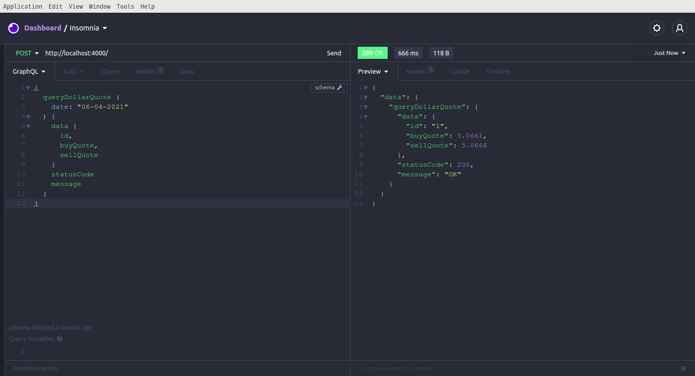
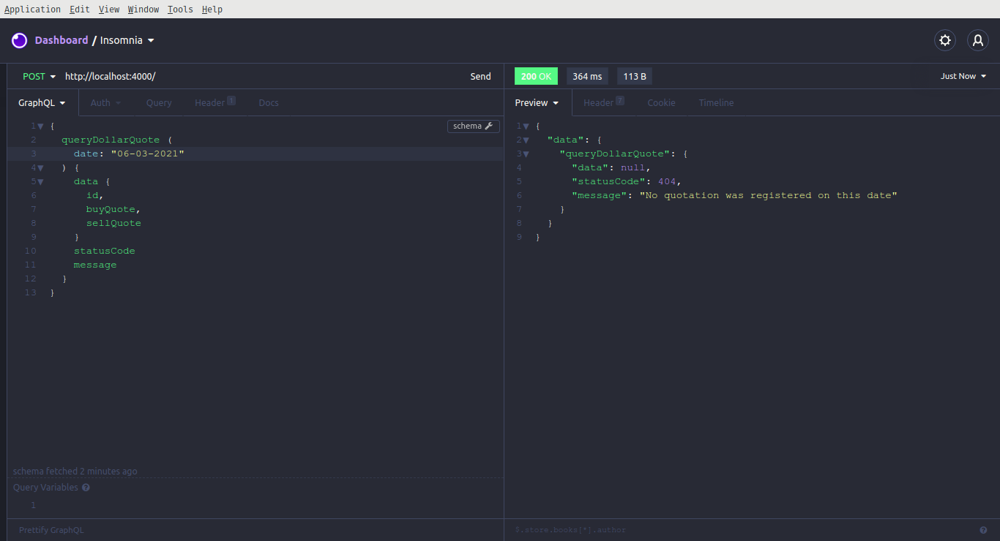

<h1 align="center">
  $$ Dollar Quote $$
  <br></br>
<p align="center">


</p>
</h1>

This consists of an API used to get the dollar quote on a given day. The requests are logged in a sqlite database. 

## Demo
### Successfull Response
<p align="center">
    
</p>

### Quote Not Found
<p align="center">
    
</p>

## Getting Started

### **Prerequisites**

- It is **necessary** to have **[Node.js](https://nodejs.org/en/)** installed on the machine;
- Also, it is **necessary** to have a package manager either **[NPM](https://www.npmjs.com/)** or **[Yarn](https://yarnpkg.com/)**;

### **Running**

1. Make a clone:

```sh
   git clone https://github.com/amintasvrp/dollar-quote.git
```

2. Running the Application:

```sh
  cd dollar-quote
  # Install dependencies
  npm install
  # Launch the API
  npm start
```

3. (OPTIONAL) Running the Application as Docker containers:

```sh
  cd core
  # Build image
  docker build -t dollar-quote .
  # Run API container
  docker run -d -it -p 4000:4000 --name dollar-quote dollar-quote
```

## Contributing

Make a pull request and make clear what changes have been made and which bugs persist. Do not introduce bugs, be proactive!

## Licenses

- **MIT License** - [_Ver detalhes_](./LICENSE.txt)
